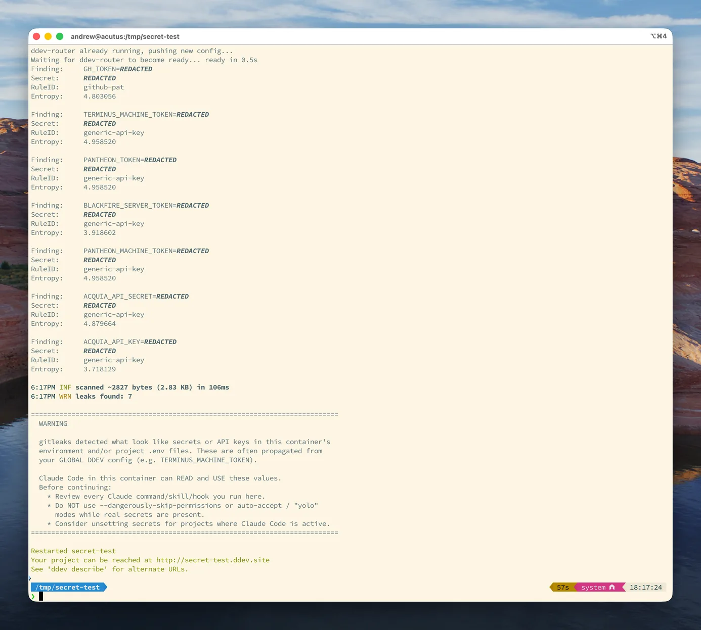

[](https://addons.ddev.com)
[](https://github.com/Lullabot/ddev-gitleaks/actions/workflows/tests.yml?query=branch%3Amain)
[](https://github.com/Lullabot/ddev-gitleaks/commits)
[](https://github.com/Lullabot/ddev-gitleaks/releases/latest)

# DDEV Gitleaks

## Overview

This add-on installs the [gitleaks](https://github.com/gitleaks/gitleaks) secret
scanner into your [DDEV](https://ddev.com/) project's web container and adds a
`post-start` hook that scans the container environment and project `.env` files
for likely secrets and API keys.

**It warns, it never blocks.** DDEV propagates global `web_environment` into every
project, so a secret set globally (for example `TERMINUS_MACHINE_TOKEN`) becomes
readable by any process in the web container — including AI coding assistants such
as Claude Code. When the scan finds something, it prints a redacted warning at the
end of `ddev start` and exits 0; it never aborts startup. Secret values are always
redacted in the output.



## Installation

```bash
ddev add-on get Lullabot/ddev-gitleaks
ddev restart
```

After installation, make sure to commit the `.ddev` directory to version control.

## Usage

The scan runs automatically on every `ddev start`. To run it on demand:

```bash
ddev exec gitleaks-scan
```

A clean project prints nothing and exits 0. When secrets are detected, a redacted
warning banner is printed. The scan never changes the exit status of `ddev start`.

## What is scanned

- The web container environment (`env`), where DDEV global and project
  `web_environment` values appear.
- `.env`-style files under the project root (`vendor/`, `node_modules/`, `.git/`,
  and `.env.example`/template files are skipped).

Benign DDEV-provided variables are allowlisted by name prefix in
`.ddev/web-build/gitleaks.toml` to avoid false positives. Add project-specific
benign variables there if needed.

## Advanced Customization

Pin a different gitleaks version with the `GITLEAKS_VERSION` build arg in
`.ddev/web-build/Dockerfile.gitleaks` (default `8.30.1`), then rebuild:

```bash
ddev debug rebuild
```

## Credits

**Contributed and maintained by [@Lullabot](https://github.com/Lullabot)**
